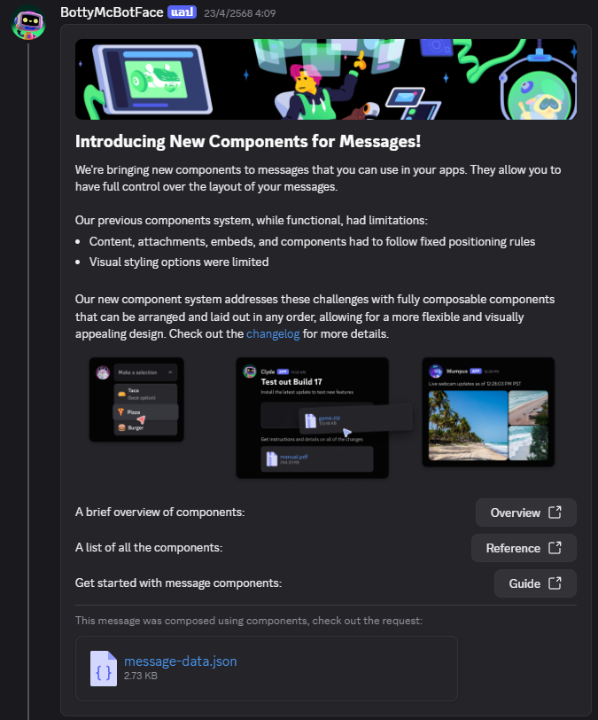
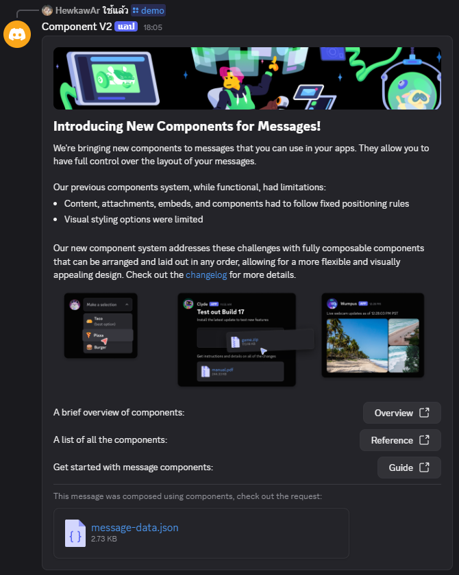

# Discord.Js Component V2 Demo Use

**Discord Update**

New Component is updated from Discord at 22/4/2025 21:09 UTC

I'm recreate that message using `discord.js` in [bot.js](bot.js)

## Cradit
- [discord.js](https://discord.js.org)
- [Discord Developer Server](https://discord.gg/discord-developers)

## Contact
- [HStudio Support](https://discord.gg/VBrrxRftj6)